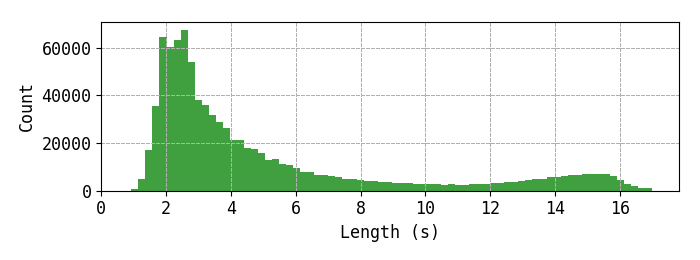

# Speech Corpus Downloader

Download and prepare common free speech corpora.
Tested with Python 3.6 and 3.7.


## Contents
<!-- TOC_START -->

* [Contents](#contents)
* [Installation](#installation)
* [Default Configuration](#default-configuration)
  * [Composition](#composition)
* [Supported Corpora](#supported-corpora)
  * [Common Voice](#common-voice)
  * [Libri Speech](#libri-speech)
  * [Tatoeba](#tatoeba)
  * [TED-LIUM](#ted-lium)
  * [TIMIT](#timit)
* [Statistics](#statistics)

<!-- TOC_END -->


## Installation
Requires: Python 3, [SoX](http://sox.sourceforge.net/).

* Go to your workspace directory.
* *Optional:* Create a [virtualenv](https://docs.python.org/3/library/venv.html).

```terminal
git clone git@github.com:mdangschat/speech-corpus-dl.git
```

Set the default corpus directory (`DATA_DIR`) in `config.py` and create it.
The default path is: `~/workspace/speech-corpus`.
The selection of used corpora for train, dev and test is currently done within the `generate.py` file.

```terminal
cd speech-corpus-dl
pip install -r requirements.txt
```

To start generating the corpus run:
```terminal
ipython generate.py
```
Be aware that this will download about 90 GiB of data and requires over 300 GiB of space to extract (if downloaded archives are not deleted).


## Default Configuration
It converts all files to 16 kHz, mono, WAV files and stores them in CSV files (e.g. `train.csv`, `dev.csv`).
Examples shorter than 0.7 or longer than 17.0 seconds are removed.
TED-LIUM examples with labels with fewer than 5 words are removed, due to a subjective higher transcription 
error rate.

The generated corpus contains about 1275 hours of speech for training and takes up 144GiB of disk space.
Example of the generated output folder structure:
```terminal
speech-corpus
├── cache
│   ├── dev-clean.tar.gz
│   ├── en.tar.gz
│   ├── tatoeba_audio_eng.zip
│   ├── TEDLIUM_release2.tar.gz
│   ├── test-clean.tar.gz
│   ├── train-clean-100.tar.gz
│   └── train-clean-360.tar.gz
├── commonvoicev2_train.csv
├── corpus
│   ├── cvv2
│   ├── LibriSpeech
│   ├── tatoeba_audio_eng
│   ├── TEDLIUM_release2
│   └── timit
├── corpus.json
├── dev.csv
├── librispeech_dev.csv
├── librispeech_test.csv
├── librispeech_train.csv
├── tatoeba_train.csv
├── tedlium_dev.csv
├── tedlium_test.csv
├── tedlium_train.csv
├── test.csv
└── train.csv
```

The generated CSV files have the following format:
```csv
path;label;length
relative/path/to/example;lower case transcription without puntuation;3.14
...
```
Where `path` is the relative WAV path from the `DATA_DIR/corpus/` directory (String).
By default `label` is the lower case transcription without punctuation (String).
Finally, `length` is the audio length in seconds (Float).


### Composition
* **train.csv**:
  * Common Voice v2, all validated files.
  * Libri Speech train set
  * Tatoeba
  * Tedlium v2 train set
* **dev.csv**:
  * Libri Speech dev set
* **test.csv**:
  * Libri Speech test set


## Supported Corpora
### Common Voice
* Website: https://voice.mozilla.org/en
* License: [CC-0](https://voice.mozilla.org/en/datasets)
* Supported versions:
    * [x] v1
    * [x] [v2](https://github.com/mozilla/CorporaCreator/blob/master/README.rst)
* **NOTE**: Please confirm [Mozilla's terms and conditions](https://voice.mozilla.org/en/datasets) before downloading Common Voice v2!


### Libri Speech
* Website: http://www.openslr.org/12/
* Paper: http://www.danielpovey.com/files/2015_icassp_librispeech.pdf
* License: CC BY 4.0
* By: Vassil Panayotov, Guoguo Chen, Daniel Povey and Sanjeev Khudanpur


### Tatoeba
* Website: https://tatoeba.org/eng/downloads
* License: Mixed


### TED-LIUM
TODO: Document
* Website: https://lium.univ-lemans.fr/ted-lium2/
* License: CC BY-NC-ND 3.0
* Supported versions:
    * [x] [release2](http://www.openslr.org/19/)
    * [ ] [release3](http://www.openslr.org/51/); [paper](https://arxiv.org/abs/1805.04699)


### TIMIT
* Website: https://catalog.ldc.upenn.edu/LDC93S1
* License: [LDC User Agreement for Non-Members](https://catalog.ldc.upenn.edu/license/ldc-non-members-agreement.pdf)
* Note: This is a special case since this is not a free corpus, therefore no download available.
    If you have a license, the corpus can be included:
    * Enable the `use_timit` flag in `generate.py`
    * Place the extracted timit data in the `corpus/timit/TIMIT/` directory of your destination folder.


## Statistics
```terminal
$ ipython tools/wav_lengths.py 
Reading audio samples: 100%|██████████████████████████████████████████████████████████████| 897948/897948 [35:38<00:00, 419.93samples/s]
Total sample length=4592557.368s (~1275h) of workspace/speech-corpus/train.csv.
Mean sample length=81832 (5.115)s.
Plot saved to: /tmp/_plot_wav_lengths.png
```


```terminal
$ ipython tools/word_counts.py 
Calculating statistics for workspace/speech-corpus/train.csv
Word based statistics:
	total_words = 11,716,026
	number_unique_words = 82,352
	mean_sentence_length = 13.05 words
	min_sentence_length = 1 words
	max_sentence_length = 84 words
	Most common words:  [('the', 649751), ('to', 347617), ('and', 296845), ('a', 279516), ('of', 271555), ('i', 220023), ('you', 181157), ('in', 174778), ('that', 162348), ('it', 139181)]
	27344 words occurred only 1 time; 37,415 words occurred only 2 times; 49,962 words occurred only 5 times; 57,979 words occurred only 10 times.

Character based statistics:
	total_characters = 60,402,553
	mean_label_length = 67.27 characters
	min_label_length = 2 characters
	max_label_length = 422 characters
	Most common characters: [(' ', 10818079), ('e', 6112206), ('t', 4864057), ('o', 4006837), ('a', 3917617), ('i', 3437314), ('n', 3319309), ('s', 3051207), ('h', 3000228), ('r', 2703305), ('d', 2059374), ('l', 1976372), ('u', 1444798), ('m', 1347476), ('w', 1231782), ('c', 1175514), ('y', 1145448), ('g', 1045719), ('f', 979325), ('p', 838584), ('b', 756279), ('v', 486572), ('k', 465861), ('j', 73971), ('x', 73567), ('q', 39701), ('z', 32051)]
	Most common characters: [' ', 'e', 't', 'o', 'a', 'i', 'n', 's', 'h', 'r', 'd', 'l', 'u', 'm', 'w', 'c', 'y', 'g', 'f', 'p', 'b', 'v', 'k', 'j', 'x', 'q', 'z']
```

